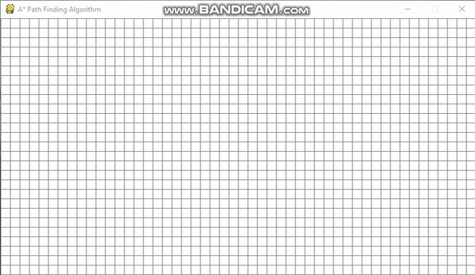

Python Pathfinding Algorithm Visualisation 

I created this project to demonstrate my ability to write and implement python code. 

Below is a video demonstrating the python pathfinding algorithm visulisation tool that i created, it leverages the A* pathfinding algorithm which is what drives the visulisation and produces the graphics seen below.

Features:
- A* pathfinding algorithm
- Place a start and end node
- Place walls
- Initiate, clear and rest visulization

